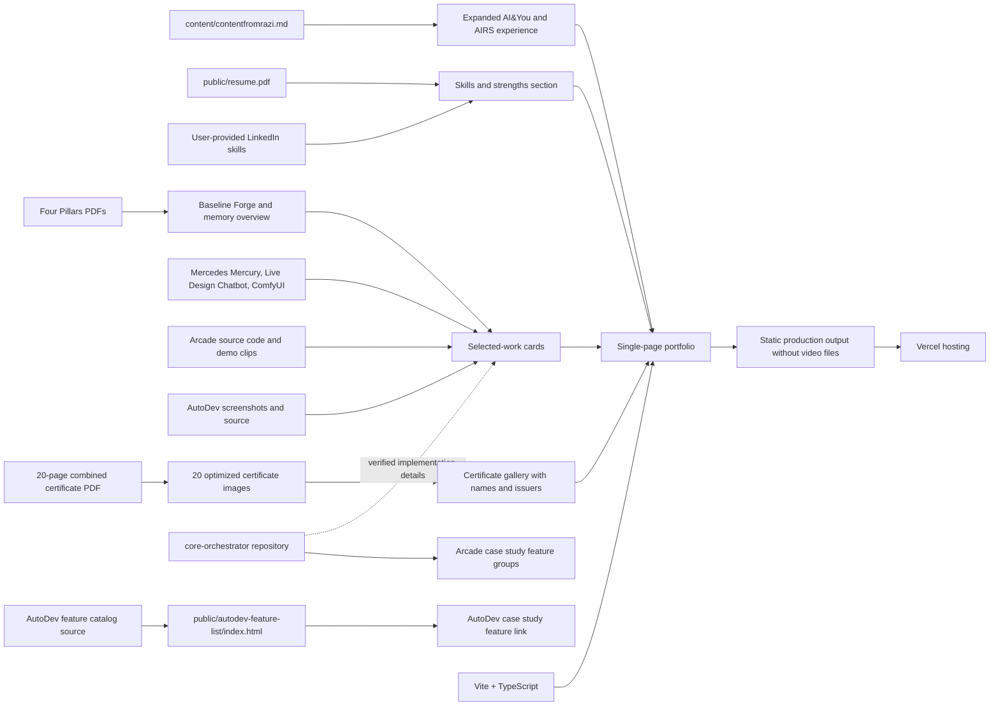

# Project Map

## Initial evidence

## Ownership and flow

- The brief owns the narrative and career timeline.
- The user-provided LinkedIn list and the authorized resume own the skills inventory; duplicate entries are consolidated in the portfolio's Skills section.
- The referenced AIRS Foundry repositories are evidence sources for technical product descriptions, not runtime dependencies.
- This repository owns the portfolio app and lightweight video poster frames; AutoDev's eight supplied screenshots are imported directly from `content/airsfoundry/autodev/` into the static build.
- Selected Work includes the five projects in `content/` and one combined Forge/memory case study. The user limited that case study to a baseline due to AIRS Foundry proprietary information; the detailed internal screenshots are not published.
- User-provided Google Drive URLs populate matching demos; original MP4 files stay out of the static output. The authorized resume is served as `public/resume.pdf`.
- The user-provided self-contained AutoDev feature catalog is published under `public/autodev-feature-list/` and linked from the AutoDev case study; the Arcade and AutoDev case-study feature grids are authored in `src/main.ts` and styled responsively in `src/style.css`.
- Build output is static and is served by Vercel; no API or database is required by the initial scope.
